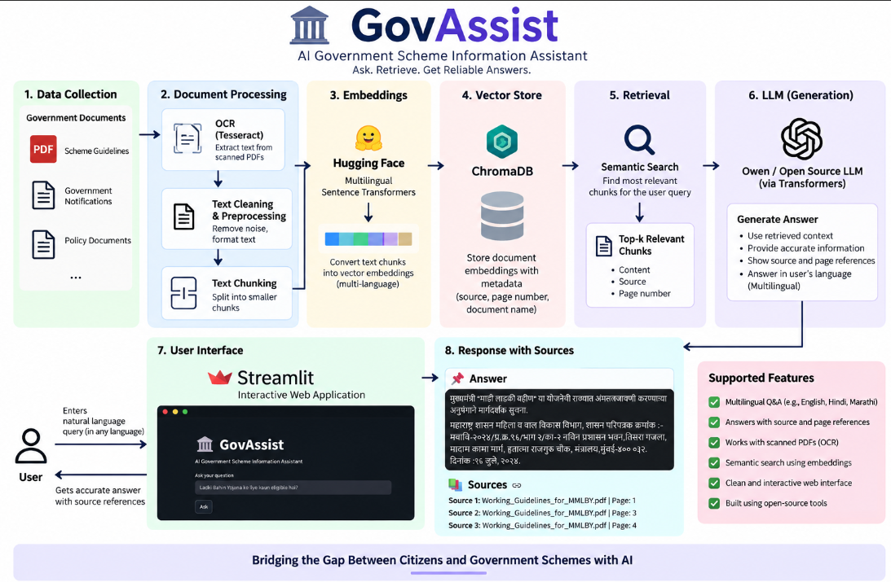
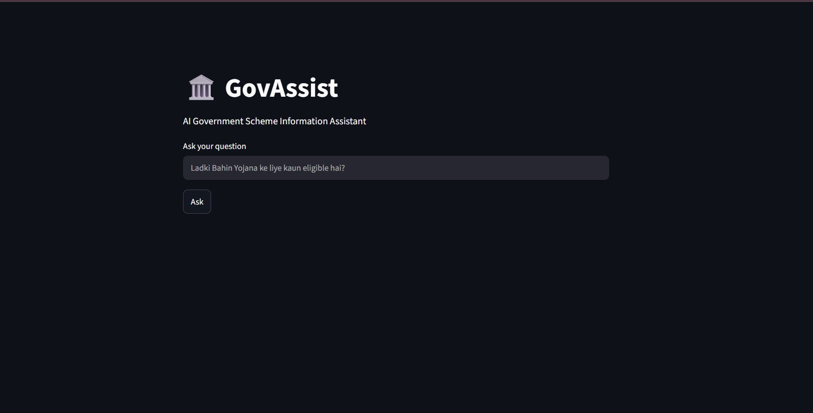
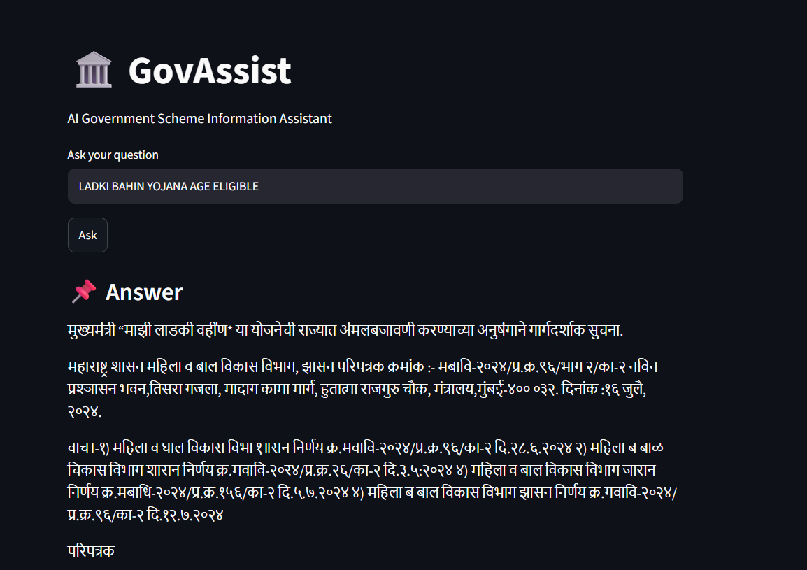
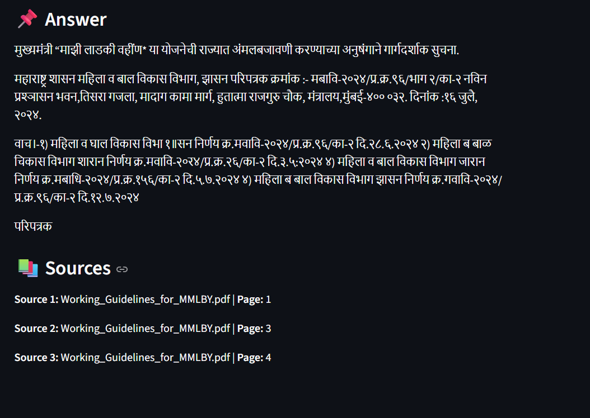

# 🏛️ GovAssist

### Multilingual AI Government Scheme Information Assistant using RAG

GovAssist is a multilingual government scheme information assistant that helps users find relevant information from official government documents.

## ✨ Features

- 🔎 Natural language search
- 🌐 Multilingual semantic search
- 📄 OCR for scanned PDF documents
- 🧩 Document chunking
- 🤗 Hugging Face multilingual embeddings
- 🗄️ ChromaDB vector database
- 📚 Source and page references
- 🖥️ Streamlit web interface

## 🏗️ Architecture



## 🔄 Workflow

Government PDF  
↓  
OCR using Tesseract  
↓  
Text Chunking  
↓  
Multilingual Embeddings  
↓  
ChromaDB Vector Store  
↓  
Semantic Retrieval  
↓  
Relevant Information  
↓  
Source & Page Reference  
↓  
Streamlit UI

## 🛠️ Tech Stack

- Python
- LangChain
- Hugging Face
- Sentence Transformers
- ChromaDB
- Tesseract OCR
- Streamlit

## 📸 Screenshots

### Home Page



### Query & Answer



### Source References



## 🚀 How to Run

### Install dependencies

```bash
pip install -r requirements.txt
```

### Run the application

```bash
streamlit run app.py
```

## ⚠️ Disclaimer

GovAssist provides information extracted from the provided government documents. Users should verify the latest scheme information and eligibility requirements from official government sources.

## 👨‍💻 Author

**Aditya Mahale**
